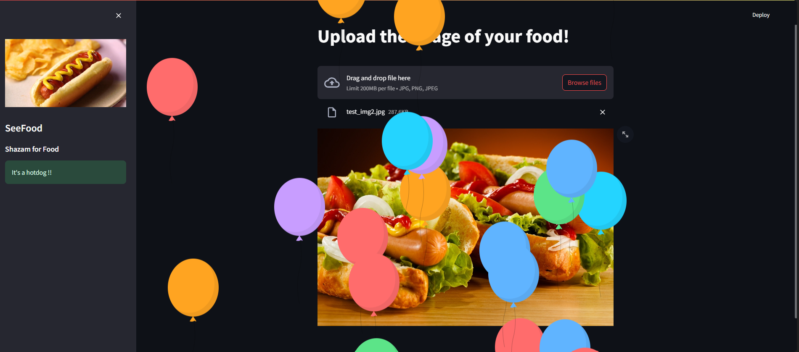
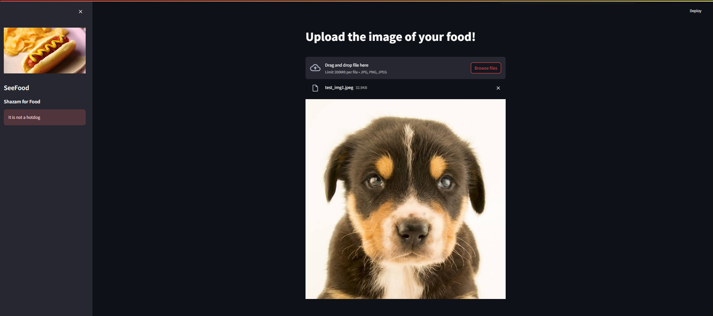

# SeeFood
The Shazam for food (Well, Kinda)


Remember that iconic scene from Silicon Valley where Erlich Bachman pivots an octopus recipes app into a hotdog-identifying app? Well, I’ve taken that not-so-genius idea and turned it into reality!  

I've tried to build it using a simple neural etwork trained on a custom self made dataset hosted as a streamlit app that can tell you whether your food is a hotdog or… well, not a hotdog. 

## Installation

1. Clone the repository using 
```sh
git clone https://github.com/AntareepDey/SeeFood.git
```
2. Install the required packages using the command:

```sh
pip install -r requirements.txt
```
3. Run the project in the web interface using
```sh
streamlit run app.py
```

## How the model was trained?
<p>

I build this project as the application of transfer learning. ```Transfer learning``` is is a technique in machine learning where a pre-trained neural network (usually trained on a large dataset) is used as a starting point for a new task. Instead of training a model from scratch, you fine-tune the pre-trained model by adjusting its weights to fit the specific problem you’re working on. 


I went with the ```resnet18``` model and changed the final layer for binary classification.The next task was to to choose a dataset. I did find a few on kaggle but after training my model on them I found the accuracy of the model to be extremely low, a part of the problem was presence of humans in the images. So I had to create my own dataset.

This custom datatset is also available on Kaggle : 
```sh 
https://www.kaggle.com/datasets/antareepdey/hotdog-silicon-valley
```

After training for few epochs (15 to be exact):


<h3>The final loss stood at :0.083 or about 91.7% accuracy. This is around 10% more than what I was getting by training on existing datasets.</h3>

I've also used the LANCZOS downsampler instead of the ANTIALIAS simply because it's better at downsampling any resolution you throw at it. Also used pytorch for model training.The model is included as ```detecttion.pt```.


## Screenshots 


<br>



The tested images are included in the files if you want to try as well!

## FAQ's
<h3>Q: Can it identify other foods?</h3>
<h4>
A: Nope. Just hotdogs.
</h4>
<h3>Q: What if I point it at a sandwich?</h3>
<h4>A: It’ll probably say, “🤔 NOT A HOTDOG!” But hey, who knows? Maybe your sandwich is secretly a hotdog in disguise.
</h4>
<h3>
Q: Is this a joke?</h3> 
<h4>A: Absolutely not. We take hotdogs very seriously. 🌭</h4>
